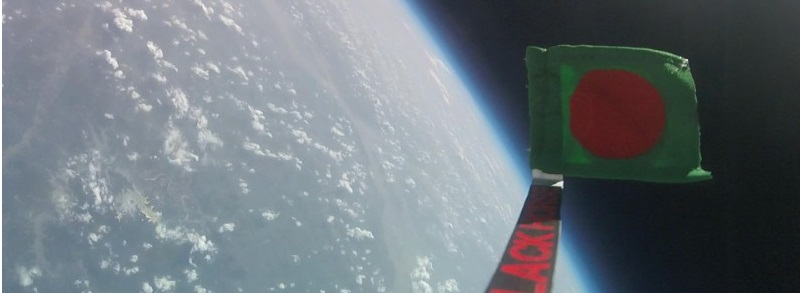
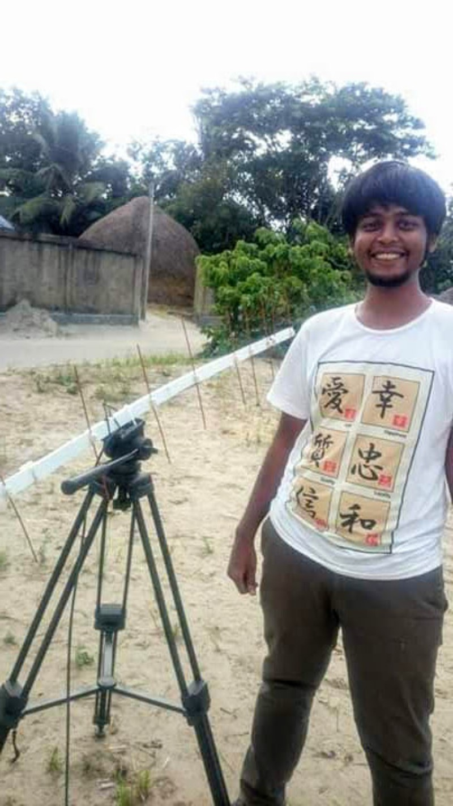
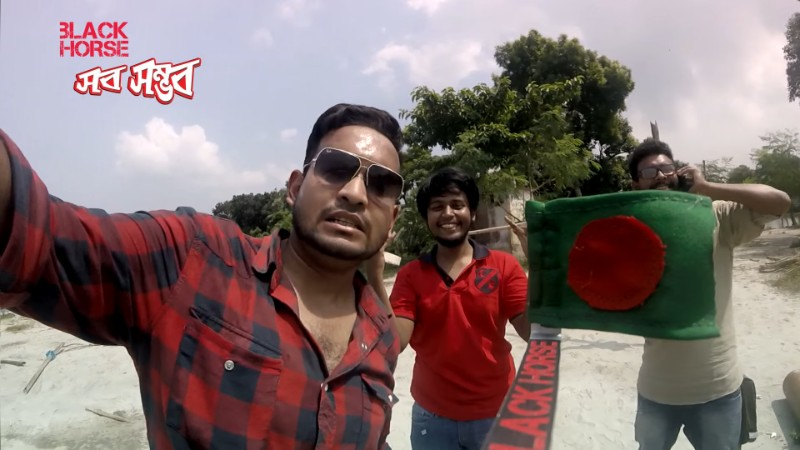

# 🎈 BlackHorse HAB

### Sending the Bangladeshi flag to the edge of space

**A high-altitude balloon that carried the Bangladeshi flag to 32,450.1 metres (≈ 106,000 ft) in 2015 — higher than anything sent up in the country before.**
This repository holds the recovered flight data, the generated graphs, and the imagery from the flight.

> 📖 **Full project write-up, context and gallery:** **https://samiulmakes.com/projects/blackhorse-hab/**

---

## 📊 Flight at a glance

| Metric | Value |
| --- | --- |
| 🛰️ **Peak altitude** | **32,450.1 m** (≈ 106,000 ft / 32.45 km) |
| ⏱️ Total flight time | 3 h 26 min 41 s |
| ⬆️ Ascent | 2 h 07 min 12 s |
| ⬇️ Descent | 1 h 19 min 29 s |
| 📍 Lateral displacement | 68.8 km |
| 🌡️ Lowest recorded external temp | −25.31 °C |
| ⚖️ Payload mass | 500 g |
| 🎈 Lift gas | Helium (Linde) |
| 📅 Year | 2015 |

---

## 🎬 The flight

▶ Click to watch the full flight recording on YouTube.

---

## 🧭 Context

In 2015 a local energy drink brand, **Black Horse**, wanted to send the Bangladeshi flag higher than anyone in the country had sent anything before. Their agency, **Dogs Day**, brought me in through a Kolpokoushol connection. I was in charge of the **onboard electronics** and the **payload fabrication**. Everything else — buying the helium, getting the permits, recovering the box from the landing zone — we figured out as we went.

## 🧩 The problem

A weather-balloon payload is mostly a question of constraints:

- It has to weigh **under 500 grams**.
- It has to survive **+40 °C on the ground to roughly −55 °C** in the stratosphere — and the batteries have to keep working at those temperatures.
- The radio has to reach back down through **30+ km of atmosphere** on a low-power **433 MHz** link.
- The whole thing has to be **cheap enough that losing it is acceptable**.

## 🛠️ What I built

I built the onboard stack around a **Raspberry Pi 2**. This was 2015 — ESP32s weren't around yet, and the Pi was the obvious choice for something we needed to prototype quickly.

### Onboard payload

| Subsystem | Hardware | Notes |
| --- | --- | --- |
| 🧠 Compute | Raspberry Pi 2 | Logging + telemetry |
| 📡 Primary downlink | Radiometrix **NTX-2b** | 433 MHz RTTY, decoded on the ground with fldigi |
| 🛰️ GPS | u-blox **NEO-6M** | Position + altitude |
| 🆘 Backup tracker | **SPOT** satellite tracker | So we'd at least find the box if the main radio failed |
| 🌡️ External temp | **DS18B20** (waterproof) | Mounted outside the enclosure |
| 🌡️ Internal temp + pressure | **BMP180** | Inside the payload |
| 🎥 Camera | **GoPro Hero Session** (modified) | Internal battery removed and wired directly to the main AA pack to survive the cold |
| 🔋 Power | **Energizer Ultimate Lithium AA** pack | Chosen for low-temperature performance |

### Ground station

I built a **Yagi antenna** out of copper rod and PVC sheet. We were travelling between possible launch sites, and close to half the build happened on the road — sourcing parts from bazars and small-town shops along the way, because there was nothing we could just buy. The receiving station was a laptop running **fldigi** for the RTTY decode.

<table>
  <tr>
    <td width="50%"></td>
    <td width="50%"></td>
  </tr>
  <tr>
    <td align="center">Hand-built Yagi antenna (copper rod + PVC), on the ground station tripod</td>
    <td align="center">The launch team — me (centre) with the payload and the flag</td>
  </tr>
</table>

### Three launches

It took three attempts:

1. **Launch 1** — the balloon was lost to weather before we got a flight.
2. **Launch 2** — flew, and we recovered the box, but the camera hadn't recorded anything; the MMC card had failed.
3. **Launch 3** — worked. 🎉

---

## 📈 Flight data & graphs

The recovered sensor log and the plots generated from it live in this repository.

<table>
  <tr>
    <td width="50%"></td>
    <td width="50%"></td>
  </tr>
  <tr>
    <td align="center">Altitude vs flight time</td>
    <td align="center">Temperature vs flight time</td>
  </tr>
  <tr>
    <td width="50%"></td>
    <td width="50%"></td>
  </tr>
  <tr>
    <td align="center">External temperature vs altitude</td>
    <td align="center">Internal temperature vs altitude</td>
  </tr>
</table>

> Full-resolution versions of every plot are in [`Generated graphs/Fullsize/`](Generated%20graphs/Fullsize).

---

## 🗂️ What's in this repository

| Path | Contents |
| --- | --- |
| [`Generated graphs/`](Generated%20graphs) | Altitude and temperature plots derived from the flight log (with full-size versions in `Fullsize/`) |
| [`Images/resized/`](Images/resized) | Flight, build, and recovery photos |
| [`Images/screencapture/`](Images/screencapture) | Frames captured from the onboard footage |
| [`Raw Data/raw_satlog.txt`](Raw%20Data/raw_satlog.txt) | The raw telemetry log decoded on the ground — including the dropouts and RTTY noise from a 433 MHz link reaching down through 30+ km of atmosphere |

---

## 🏆 Outcome

We recovered the box, the GoPro, and a complete sensor log. The footage became the centrepiece of the campaign, and the data plots in this repository tell the rest of the story.

- 🛰️ Highest altitude reached: **32,450.1 metres** (≈ 106,000 ft)
- ⏱️ Total flight time: **3 h 26 min 41 s**
- 📍 Lateral displacement: **68.8 km**
- 🌡️ Lowest recorded external temperature: **−25.31 °C**

> 💡 **Fun fact:** pure helium is genuinely scarce in Bangladesh. Most of the project budget went to gas.

---

## 🔗 Links

- 📖 **Full project write-up & gallery:** https://samiulmakes.com/projects/blackhorse-hab/
- ▶️ **Full flight recording:** https://www.youtube.com/watch?v=uRRbZOm5O_c
- ▶️ **Campaign video:** https://www.youtube.com/watch?v=KUweosio60A

---

Built by <a href="https://samiulmakes.com">Samiul Hoque</a> · Technical engineer — onboard electronics, payload fabrication, recovery · Black Horse (via Dogs Day), 2015

